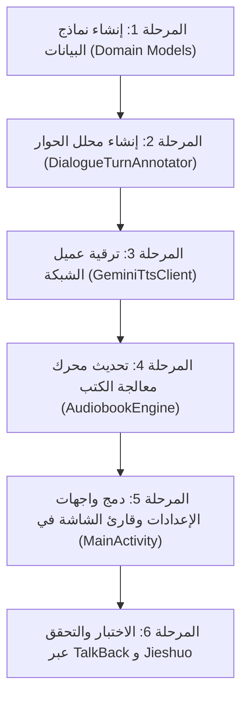

# دليل التصميم والتكامل المعماري لتطبيق أندرويد (Kotlin Blueprint)
## دمج قدرات Gemini 3.8 Flash TTS المتقدمة: تصميم الأصوات، الحوار متعدد الرواة، وأنماط الإلقاء الصوتية
### موجه لبيئة Android (Kotlin) مع الدعم الكامل لقارئات الشاشة (TalkBack و Jieshuo / CSR)

---

## 1. نظرة عامة معمارية (Architectural Overview)

يهدف هذا الدليل المعماري إلى توفير مخطط هندسي متكامل وعالي الدقة لتحديث وتطوير تطبيق أندرويد **Gemini Audiobook TTS** (`com.antigravity.audiobook`) المكتوب بلغة **Kotlin**، للاستفادة الكاملة من إمكانيات الجيل الجديد لنموذج **Gemini 3.8 Flash TTS** (`gemini-3.8-flash-tts` و `gemini-3.8-flash-lite-tts`).

### الركائز الأساسية للتكامل الجديد:
1. **أنماط الإلقاء الصوتي المسبقة (Voice Style Presets)**:
   - دعم التوجيه الإخراجي الصوتي عبر `systemInstruction` لنماذج Gemini TTS.
   - توفير أنماط مدروسة: **الوثائقي (Documentary)**، **الدرامي (Dramatic)**، **الهادئ (Calm)**، و**الطبيعي (Natural)**.
2. **التوليد الصوتي متعدد الرواة (Multi-Speaker Synthesis via `multiSpeakerVoiceConfig`)**:
   - دعم ميزة توليد الحوار بصوتين في استدعاء شبكي واحد (Single Request) حتى متحدثين اثنين (`Narrator` و `Character`).
   - معالجة النصوص القصصية والروايات عبر محلل ذكي للحوار (`DialogueTurnAnnotator`) يفرز كلام الراوي عن كلام الشخصيات المحصور بين علامات التنصيص (`«...»` أو `"..."`).
3. **دعم الأصوات المصممة ومعرفات الصوت المخصصة (Custom Voice Design IDs)**:
   - تمكين المستخدم من استخدام الأصوات القياسية المعتمدة (`Kore`, `Puck`, `Charon`, `Fenrir`, `Aoede`) أو إدخال معرف صوت مخصص (`voice_id` ناتج عن ميزة **Voice Design** في Google AI Studio).
4. **التوافق التام مع قارئات الشاشة (TalkBack & Jieshuo CSR Accessibility)**:
   - تصميم واجهات مستخدم خالصة بدون أي جداول أفقية معقدة أو عناصر تسحب التركيز بشكل عشوائي.
   - الاعتماد الكامل على مربعات حوار الاختيار الفردي (`AlertDialog` مع `SingleChoiceItems`) والأزرار الواضحة ذات أبعاد لمس لا تقل عن 48×48dp مع `contentDescription` دقيق، وإشعارات حية عبر `accessibilityLiveRegion="polite"`.

---

## 2. تحليل الفجوات في الشيفرة الحالية (Current Codebase Audit & Gap Analysis)

بمراجعة الشيفرة الحالية في مسارات:
- `com.antigravity.audiobook.data.GeminiTtsClient`
- `com.antigravity.audiobook.engine.AudiobookEngine`
- `com.antigravity.audiobook.MainActivity`

تم رصد الفجوات الهندسية التالية:

| المكون الحالي | الوضع الراهن | الفجوة المعمارية | التحسين المطلوب في المخطط |
| :--- | :--- | :--- | :--- |
| `GeminiTtsClient` | يرسل فقط `prebuiltVoiceConfig` بصوت واحد | معامل `style` موجود بالدالة لكن لا يُحقن في الـ Payload | إضافة `systemInstruction` مخصصة لتوجيه النبرة والإيقاع، ودعم `multiSpeakerVoiceConfig` |
| أصوات Gemini | قائمة ثابتة محدودة بخمسة أسماء (`APPROVED_VOICES`) | لا يوجد خيار لإدخال `Voice ID` مخصص من Voice Design | إضافة كائن `VoiceProfile` يدعم الأصوات الرسمية والمعرفات المخصصة |
| `AudiobookEngine` | يقسم النص إلى فقرات ومقاطع متصلة (Flat Text) | لا يميز بين السرد والحوار الدرامي | دمج `DialogueTurnAnnotator` لتوسيم الحوار للمتحدث الثاني تلقائياً |
| `MainActivity` | شاشة إعدادات تقتصر على إدخال الـ Key واختيار الصوت | غياب خيارات نمط الأداء والحوار المتعدد | واجهة إعدادات ميسرة تدعم اختيار النمط وتفعيل الرواية الثنائية |

---

## 3. نماذج البيانات الجديدة في كوتلن (Domain Data Models)

### أ. كائن نمط الإلقاء الصوتي (`VoiceStylePreset.kt`)

```kotlin
package com.antigravity.audiobook.domain

/**
 * أنماط الإلقاء الصوتي الموجهة لنموذج Gemini 3.8 Flash TTS.
 * يتم حقن التوجيه (Prompt Instruction) في كائن systemInstruction في الطلب.
 */
enum class VoiceStylePreset(
    val id: String,
    val titleArabic: String,
    val descriptionArabic: String,
    val promptInstruction: String
) {
    NATURAL(
        id = "natural",
        titleArabic = "طبيعي ومتوازن (افتراضي)",
        descriptionArabic = "قراءة هادئة وواضحة تناسب معظم الكتب والمقالات العامة.",
        promptInstruction = "You are a professional, warm, and natural audiobook narrator. Deliver the text with clear enunciation, balanced cadence, and authentic conversational pauses."
    ),
    DOCUMENTARY(
        id = "documentary",
        titleArabic = "وثائقي ورصين (Documentary)",
        descriptionArabic = "نبرة وقورة وموضوعية ذات إيقاع متزن، ممتازة للمراجع وكتب التاريخ والدراسات العلمية.",
        promptInstruction = "You are an authoritative historical documentary narrator. Speak with a steady, deep, deliberate, and respectful tone. Maintain an objective cadence with thoughtful pauses between historical facts."
    ),
    DRAMATIC(
        id = "dramatic",
        titleArabic = "درامي ومسرحي (Dramatic)",
        descriptionArabic = "نبرة تعبيرية غنية بالمشاعر والإثارة السينمائية، مثالية للروايات والقصص المشوقة.",
        promptInstruction = "You are an expressive dramatic storyteller. Inject emotional color, suspense, and dynamic pacing into the performance. Reflect the tension and mood swings of the literary narrative vividly."
    ),
    CALM(
        id = "calm",
        titleArabic = "هادئ ومريح (Calm / Bedtime)",
        descriptionArabic = "صوت ناعم ومسترخٍ بإيقاع بطيء، مثالي لكتب ما قبل النوم والتأمل.",
        promptInstruction = "You are a soothing and gentle narrator. Read with a soft, peaceful, and relaxed voice. Pacing should be unhurried and calming, creating a tranquil listening atmosphere."
    );

    companion object {
        fun fromId(id: String?): VoiceStylePreset {
            return entries.firstOrNull { it.id.equals(id, ignoreCase = true) } ?: NATURAL
        }

        fun getAccessibleDisplayList(): Array<String> {
            return entries.map { "${it.titleArabic} - ${it.descriptionArabic}" }.toTypedArray()
        }
    }
}
```

---

### ب. كائن تعريف الصوت المخصص والمسبق (`VoiceProfile.kt`)

```kotlin
package com.antigravity.audiobook.domain

/**
 * يمثل صوتاً إما مسبق الصنع من Google أو معرف صوت مخصص مولد عبر Voice Design.
 */
data class VoiceProfile(
    val id: String,
    val displayNameArabic: String,
    val isCustomVoiceDesign: Boolean = false,
    val description: String = ""
) {
    companion object {
        val PREBUILT_VOICES = listOf(
            VoiceProfile("Kore", "كوري (Kore) - صوت أنثوي متزن ووقور", false, "أنثوي رصين للمتون والرواية"),
            VoiceProfile("Charon", "شارون (Charon) - صوت رجالي عميق وفخم", false, "رجالي وقور، رائع للكتب التاريخية والوثائقية"),
            VoiceProfile("Puck", "باك (Puck) - صوت حيوي وتفاعلي", false, "رجالي متوسط النبرة، رشيق للحوار والقصص الخفيفة"),
            VoiceProfile("Fenrir", "فنرير (Fenrir) - صوت قوي وأجش", false, "رجالي قوي ذو طابع درامي مسرحي"),
            VoiceProfile("Aoede", "أويدي (Aoede) - صوت شاعري ناعم", false, "أنثوي هادئ وشاعري للكتب الأدبية")
        )

        fun defaultNarrator(): VoiceProfile = PREBUILT_VOICES[0] // Kore
        fun defaultCharacter(): VoiceProfile = PREBUILT_VOICES[1] // Charon

        fun fromStoredString(stored: String): VoiceProfile {
            val trimmed = stored.trim()
            val prebuilt = PREBUILT_VOICES.firstOrNull { it.id.equals(trimmed, ignoreCase = true) }
            if (prebuilt != null) return prebuilt

            return VoiceProfile(
                id = trimmed,
                displayNameArabic = "صوت مخصص: $trimmed",
                isCustomVoiceDesign = true,
                description = "معرف مخصص تم إنشاؤه عبر Voice Design"
            )
        }
    }
}
```

---

### ج. إعدادات الحوار متعدد المتحدثين (`MultiSpeakerConfig.kt`)

```kotlin
package com.antigravity.audiobook.domain

import org.json.JSONArray
import org.json.JSONObject

/**
 * تكوين ميزة Multi-Speaker لنموذج Gemini 3.8 Flash TTS.
 * يدعم متحدثين اثنين: الراوي الأساسي (Narrator) والمتحدث الحواري (Character).
 */
data class MultiSpeakerConfig(
    val isEnabled: Boolean = false,
    val narratorAlias: String = "Narrator",
    val narratorVoice: VoiceProfile = VoiceProfile.defaultNarrator(),
    val characterAlias: String = "Character",
    val characterVoice: VoiceProfile = VoiceProfile.defaultCharacter()
) {
    /**
     * بناء كائن multiSpeakerVoiceConfig متوافق 100% مع مواصفات Gemini TTS الرسمية.
     */
    fun toSpeechConfigJson(): JSONObject {
        val config = JSONObject()
        val multiSpeaker = JSONObject()
        val speakerArray = JSONArray()

        // المتحدث الأول: الراوي
        val speaker1 = JSONObject().apply {
            put("speakerAlias", narratorAlias)
            put("speakerId", narratorVoice.id)
        }
        speakerArray.put(speaker1)

        // المتحدث الثاني: الشخصيات / الحوار
        val speaker2 = JSONObject().apply {
            put("speakerAlias", characterAlias)
            put("speakerId", characterVoice.id)
        }
        speakerArray.put(speaker2)

        multiSpeaker.put("speakerVoiceConfigs", speakerArray)
        config.put("multiSpeakerVoiceConfig", multiSpeaker)
        return config
    }
}
```

---

## 4. تطوير عميل الشبكة ومخطط الحزم (`GeminiTtsClient.kt`)

### أ. مخطط الـ JSON Payload الرسمي لـ Gemini 3.8 Flash TTS

#### 1. طلب الصوت الفردي مع النمط الصوتي (Single Speaker with Voice Style):
```json
{
  "contents": [
    {
      "parts": [
        {
          "text": "كانت القاهرة في القرن الثامن الهجري حاضرة الدنيا ومركزاً جامعاً للعلم والعلماء..."
        }
      ]
    }
  ],
  "systemInstruction": {
    "parts": [
      {
        "text": "You are an authoritative historical documentary narrator. Speak with a steady, deep, deliberate, and respectful tone. Maintain an objective cadence with thoughtful pauses between historical facts."
      }
    ]
  },
  "generationConfig": {
    "responseModalities": ["AUDIO"],
    "speechConfig": {
      "voiceConfig": {
        "prebuiltVoiceConfig": {
          "voiceName": "Charon"
        }
      }
    }
  }
}
```

#### 2. طلب الحوار الثنائي (Multi-Speaker Dialogue):
```json
{
  "contents": [
    {
      "parts": [
        {
          "text": "Narrator: وقف الشيخ في صحن الجامع الأزهر متأملاً الطلاب، ثم قال بصوت رصين.\nCharacter: يا طلاب العلم، اعلموا أن التاريخ مرآة الزمان وسير الأوائل.\nNarrator: فأصغى الجميع في خشوع وتأدب."
        }
      ]
    }
  ],
  "systemInstruction": {
    "parts": [
      {
        "text": "Perform a natural audio drama reading. Follow the speaker turn indicators 'Narrator' and 'Character' strictly, switching vocal performance seamlessly."
      }
    ]
  },
  "generationConfig": {
    "responseModalities": ["AUDIO"],
    "speechConfig": {
      "multiSpeakerVoiceConfig": {
        "speakerVoiceConfigs": [
          {
            "speakerAlias": "Narrator",
            "speakerId": "Kore"
          },
          {
            "speakerAlias": "Character",
            "speakerId": "Charon"
          }
        ]
      }
    }
  }
}
```

---

### ب. الشيفرة الكاملة المحدثة لعميل GeminiTtsClient

```kotlin
package com.antigravity.audiobook.data

import android.util.Base64
import android.util.Log
import com.antigravity.audiobook.domain.MultiSpeakerConfig
import com.antigravity.audiobook.domain.VoiceProfile
import com.antigravity.audiobook.domain.VoiceStylePreset
import kotlinx.coroutines.Dispatchers
import kotlinx.coroutines.delay
import kotlinx.coroutines.withContext
import okhttp3.MediaType.Companion.toMediaType
import okhttp3.OkHttpClient
import okhttp3.Request
import okhttp3.RequestBody.Companion.toRequestBody
import org.json.JSONArray
import org.json.JSONObject
import java.io.File
import java.io.FileOutputStream
import java.nio.ByteBuffer
import java.nio.ByteOrder
import java.util.concurrent.TimeUnit
import kotlin.math.sin

/**
 * عميل Gemini 3.8 Flash TTS المطور لنظام أندرويد.
 * يدعم: أنماط الإلقاء (Style Presets)، الحوار متعدد الأصوات (Multi-Speaker)،
 * ومعرفات الصوت المخصصة (Voice Design).
 */
class GeminiTtsClient(
    private val apiKey: String,
    private val modelId: String = DEFAULT_MODEL_ID,
    private val customEndpoint: String? = null
) {

    companion object {
        const val DEFAULT_MODEL_ID = "gemini-3.8-flash-tts"
        private const val BASE_URL = "https://generativelanguage.googleapis.com/v1beta/models"
        private const val TAG = "GeminiTtsClient"
        private val JSON_MEDIA_TYPE = "application/json; charset=utf-8".toMediaType()

        fun createWavHeader(
            pcmData: ByteArray,
            sampleRate: Int = 24000,
            channels: Short = 1,
            bitsPerSample: Short = 16
        ): ByteArray {
            val byteRate = sampleRate * channels * (bitsPerSample / 8)
            val blockAlign = (channels * (bitsPerSample / 8)).toShort()
            val dataSize = pcmData.size
            val fileSize = 36 + dataSize

            val buffer = ByteBuffer.allocate(44).order(ByteOrder.LITTLE_ENDIAN)
            buffer.put("RIFF".toByteArray())
            buffer.putInt(fileSize)
            buffer.put("WAVE".toByteArray())
            buffer.put("fmt ".toByteArray())
            buffer.putInt(16)
            buffer.putShort(1)
            buffer.putShort(channels)
            buffer.putInt(sampleRate)
            buffer.putInt(byteRate)
            buffer.putShort(blockAlign)
            buffer.putShort(bitsPerSample)
            buffer.put("data".toByteArray())
            buffer.putInt(dataSize)

            val header = buffer.array()
            val fullWav = ByteArray(header.size + pcmData.size)
            System.arraycopy(header, 0, fullWav, 0, header.size)
            System.arraycopy(pcmData, 0, fullWav, header.size, pcmData.size)
            return fullWav
        }

        fun generateSyntheticWav(durationSeconds: Double = 1.0, sampleRate: Int = 24000): ByteArray {
            val totalSamples = (durationSeconds * sampleRate).toInt()
            val amplitude = 12000.0
            val frequencyHz = 440.0
            val pcmBuffer = ByteBuffer.allocate(totalSamples * 2).order(ByteOrder.LITTLE_ENDIAN)

            for (i in 0 until totalSamples) {
                val envelope = sin(Math.PI * i / totalSamples)
                val sampleVal = (amplitude * envelope * sin(2.0 * Math.PI * frequencyHz * (i.toDouble() / sampleRate))).toInt()
                pcmBuffer.putShort(sampleVal.coerceIn(-32768, 32767).toShort())
            }

            return createWavHeader(pcmBuffer.array(), sampleRate = sampleRate)
        }
    }

    private val httpClient = OkHttpClient.Builder()
        .connectTimeout(30, TimeUnit.SECONDS)
        .readTimeout(60, TimeUnit.SECONDS)
        .writeTimeout(60, TimeUnit.SECONDS)
        .build()

    fun hasApiKey(): Boolean = apiKey.isNotBlank() && apiKey.trim().length >= 15

    /**
     * دالة التوليد الصوتي الشاملة:
     * تدعم نمط الإلقاء الصوتي الموجه، وتدعم الحوار الثنائي عند تفعيل multiSpeakerConfig.
     */
    suspend fun synthesize(
        text: String,
        voiceName: String = "Kore",
        stylePreset: VoiceStylePreset = VoiceStylePreset.NATURAL,
        multiSpeakerConfig: MultiSpeakerConfig? = null
    ): ByteArray = withContext(Dispatchers.IO) {
        val cleanText = text.trim()
        if (cleanText.isEmpty()) {
            return@withContext generateSyntheticWav(0.1)
        }

        if (!hasApiKey()) {
            throw IllegalArgumentException("مفتاح Gemini API غير مهيأ.")
        }

        val url = customEndpoint ?: "$BASE_URL/$modelId:generateContent?key=$apiKey"

        val payload = JSONObject().apply {
            // 1. Text Content
            put("contents", JSONArray().apply {
                put(JSONObject().apply {
                    put("parts", JSONArray().apply {
                        put(JSONObject().apply {
                            put("text", cleanText)
                        })
                    })
                })
            })

            // 2. System Instruction for Voice Style & Direction
            val instructionText = if (multiSpeakerConfig != null && multiSpeakerConfig.isEnabled) {
                "${stylePreset.promptInstruction} This is a multi-speaker dramatic dialogue audiobook. Strictly follow speaker turn prefixes like '${multiSpeakerConfig.narratorAlias}:' and '${multiSpeakerConfig.characterAlias}:'."
            } else {
                stylePreset.promptInstruction
            }

            put("systemInstruction", JSONObject().apply {
                put("parts", JSONArray().apply {
                    put(JSONObject().apply {
                        put("text", instructionText)
                    })
                })
            })

            // 3. Generation Config: Audio Modality + Speech Config
            put("generationConfig", JSONObject().apply {
                put("responseModalities", JSONArray().apply {
                    put("AUDIO")
                })

                val speechConfig = if (multiSpeakerConfig != null && multiSpeakerConfig.isEnabled) {
                    // Multi-Speaker branch
                    multiSpeakerConfig.toSpeechConfigJson()
                } else {
                    // Single-Speaker branch (Prebuilt or Custom Voice Design ID)
                    JSONObject().apply {
                        put("voiceConfig", JSONObject().apply {
                            put("prebuiltVoiceConfig", JSONObject().apply {
                                put("voiceName", voiceName)
                            })
                        })
                    }
                }
                put("speechConfig", speechConfig)
            })
        }

        val requestBody = payload.toString().toRequestBody(JSON_MEDIA_TYPE)
        val request = Request.Builder()
            .url(url)
            .post(requestBody)
            .header("User-Agent", "GeminiAudiobookAndroid/1.1")
            .build()

        var attempt = 0
        val maxAttempts = 3
        while (attempt < maxAttempts) {
            attempt++
            var shouldRetry = false
            val retryDelayMs = 20000L
            var audioResult: ByteArray? = null

            httpClient.newCall(request).execute().use { response ->
                if (response.code == 429) {
                    val errorBody = response.body?.string() ?: ""
                    Log.w(TAG, "Gemini HTTP 429 Rate Limit (attempt $attempt/$maxAttempts): $errorBody")
                    if (attempt < maxAttempts) {
                        shouldRetry = true
                    } else {
                        throw IllegalStateException("API error 429: تم تجاوز حد الطلبات للدقيقة (Rate limit). يرجى الانتظار دقيقة والمحاولة مجدداً.")
                    }
                } else if (!response.isSuccessful) {
                    val errorBody = response.body?.string() ?: ""
                    Log.e(TAG, "Gemini HTTP error ${response.code}: $errorBody")
                    throw IllegalStateException("API error ${response.code}: $errorBody")
                } else {
                    val responseStr = response.body?.string() ?: ""
                    val json = JSONObject(responseStr)
                    val audioBytes = extractAudioBytes(json)
                    audioResult = if (audioBytes.size >= 4 &&
                        audioBytes[0] == 'R'.code.toByte() &&
                        audioBytes[1] == 'I'.code.toByte() &&
                        audioBytes[2] == 'F'.code.toByte() &&
                        audioBytes[3] == 'F'.code.toByte()
                    ) {
                        audioBytes
                    } else {
                        createWavHeader(audioBytes, sampleRate = 24000)
                    }
                }
            }

            if (audioResult != null) {
                return@withContext audioResult!!
            }

            if (shouldRetry) {
                Log.i(TAG, "Waiting 20 seconds before retry attempt $attempt/$maxAttempts...")
                delay(retryDelayMs)
            }
        }

        throw IllegalStateException("فشل توليد الصوت بعد $maxAttempts محاولات بسبب ضغط الطلبات.")
    }

    private fun extractAudioBytes(json: JSONObject): ByteArray {
        if (json.has("audioContent")) {
            return Base64.decode(json.getString("audioContent"), Base64.DEFAULT)
        }
        if (json.has("audio")) {
            return Base64.decode(json.getString("audio"), Base64.DEFAULT)
        }
        if (json.has("candidates")) {
            val candidates = json.getJSONArray("candidates")
            if (candidates.length() > 0) {
                val candidate = candidates.getJSONObject(0)
                val content = candidate.optJSONObject("content")
                val parts = content?.optJSONArray("parts")
                if (parts != null && parts.length() > 0) {
                    val part = parts.getJSONObject(0)
                    val inlineData = part.optJSONObject("inlineData")
                    if (inlineData != null && inlineData.has("data")) {
                        return Base64.decode(inlineData.getString("data"), Base64.DEFAULT)
                    }
                    val audioData = part.optJSONObject("audioData")
                    if (audioData != null && audioData.has("data")) {
                        return Base64.decode(audioData.getString("data"), Base64.DEFAULT)
                    }
                }
            }
        }
        if (json.has("output")) {
            return Base64.decode(json.getString("output"), Base64.DEFAULT)
        }

        throw IllegalArgumentException("Audio data not found in response JSON.")
    }

    fun saveAudioAtomically(targetFile: File, audioBytes: ByteArray) {
        targetFile.parentFile?.mkdirs()
        val tempFile = File(targetFile.parentFile, "${targetFile.name}.tmp_${System.currentTimeMillis()}")
        FileOutputStream(tempFile).use { fos ->
            fos.write(audioBytes)
            fos.flush()
        }
        if (!tempFile.renameTo(targetFile)) {
            tempFile.copyTo(targetFile, overwrite = true)
            tempFile.delete()
        }
    }
}
```

---

## 5. محرك تحليل الحوار وتحضير المقاطع (`DialogueTurnAnnotator.kt`)

لتمكين ميزة الـ Multi-Speaker في الكتب والنصوص التراثية والروايات دون مطالبة أحمد بكتابة نصوص يدوية موسومة، تم تصميم وحدة **`DialogueTurnAnnotator`**. تقوم هذه الوحدة بمسح النص، وفرز الجمل المحصورة بين أقواس الاقتباس العربية أو اللاتينية (`«...»`، `"..."`، `“...”`) وتوسيمها باسم متحدث الحوار (`Character:` أو الاسم المخصص)، بينما توسم باقي المتن السردي باسم الراوي (`Narrator:`).

```kotlin
package com.antigravity.audiobook.domain

/**
 * محلل ذكي يكتشف الحوارات والأقوال في النصوص العربية واللاتينية،
 * ويحول النص العادي إلى حوار موسوم بأسماء المتحدثين ليتوافق مع multiSpeakerVoiceConfig.
 */
class DialogueTurnAnnotator(
    private val narratorAlias: String = "Narrator",
    private val characterAlias: String = "Character"
) {

    companion object {
        // تعبير نمطي يدعم الأقواس العربية «...» وعلامات التنصيص المزدوجة "..." و “...”
        private val DIALOGUE_PATTERN = Regex("(«[^»]+»|\"[^\"]+\"|“[^”]+”)")
    }

    /**
     * تحويل النص إلى حوار منظم:
     * إذا لم يحتوِ النص على حوار، يوسم بالكامل كـ Narrator.
     * إذا احتوى على اقتباسات، يُفصل السرد عن الحوار بسلاسة.
     */
    fun annotateText(rawText: String): String {
        val trimmed = rawText.trim()
        if (trimmed.isEmpty()) return ""

        val lines = trimmed.split("\n")
        val result = StringBuilder()

        for (line in lines) {
            val cleanLine = line.trim()
            if (cleanLine.isEmpty()) {
                result.append("\n")
                continue
            }

            var lastIndex = 0
            val matches = DIALOGUE_PATTERN.findAll(cleanLine).toList()

            if (matches.isEmpty()) {
                // سطر سردي خالص
                result.append("$narratorAlias: $cleanLine\n")
            } else {
                for (match in matches) {
                    val range = match.range
                    // النص السردي قبل الحوار
                    if (range.first > lastIndex) {
                        val narrativePart = cleanLine.substring(lastIndex, range.first).trim()
                        if (narrativePart.isNotEmpty()) {
                            result.append("$narratorAlias: $narrativePart\n")
                        }
                    }

                    // مقطع الحوار (مع تجريد علامات الاقتباس)
                    val quote = match.value
                    val spokenText = quote
                        .removePrefix("«").removeSuffix("»")
                        .removePrefix("\"").removeSuffix("\"")
                        .removePrefix("“").removeSuffix("”")
                        .trim()

                    if (spokenText.isNotEmpty()) {
                        result.append("$characterAlias: $spokenText\n")
                    }
                    lastIndex = range.last + 1
                }

                // ما تبقى من السطر بعد آخر حوار
                if (lastIndex < cleanLine.length) {
                    val remaining = cleanLine.substring(lastIndex).trim()
                    if (remaining.isNotEmpty()) {
                        result.append("$narratorAlias: $remaining\n")
                    }
                }
            }
        }

        return result.toString().trim()
    }
}
```

---

## 6. تحديث محرك الكتب الصوتي (`AudiobookEngine.kt`)

يتم تمرير إعدادات الإلقاء والحوار الثنائي في باني `AudiobookEngine`، ويتم تطبيق الـ Annotator على مقاطع النص تلقائياً إذا كان الحوار المتعدد مفعلاً:

```kotlin
class AudiobookEngine(
    private val context: Context,
    private val outputDir: File,
    private val ttsClient: GeminiTtsClient,
    private val voiceName: String = "Kore",
    private val stylePreset: VoiceStylePreset = VoiceStylePreset.NATURAL,
    private val multiSpeakerConfig: MultiSpeakerConfig = MultiSpeakerConfig()
) {
    // ...
    private val dialogueAnnotator = DialogueTurnAnnotator(
        narratorAlias = multiSpeakerConfig.narratorAlias,
        characterAlias = multiSpeakerConfig.characterAlias
    )

    // داخل حلقة معالجة المقاطع textChunks:
    val textToSend = if (multiSpeakerConfig.isEnabled) {
        dialogueAnnotator.annotateText(chunkText)
    } else {
        chunkText
    }

    val audioData = ttsClient.synthesize(
        text = textToSend,
        voiceName = voiceName,
        stylePreset = stylePreset,
        multiSpeakerConfig = if (multiSpeakerConfig.isEnabled) multiSpeakerConfig else null
    )
    // ...
}
```

---

## 7. هندسة واجهات المستخدم المتوافقة كلياً مع TalkBack و Jieshuo

### أ. معايير إمكانية الوصول الصارمة (Screen Reader Invariants):
1. **منع الجداول الأفقية والعناصر المتداخلة**: كافة الإعدادات تُعرض في قوائم عمودية سلسة وقابلة للتمرير بقارئ الشاشة.
2. **استخدام مربعات حوار الاختيار الفردي القياسية (`setSingleChoiceItems`)**: يفضلها كل من TalkBack و Jieshuo لأنها تنطق رقم العنصر وحالته ("محدد" أو "غير محدد") وترتيبه ("العنصر 2 من 4").
3. **وصف دقيق للأزرار التفاعلية (`contentDescription`)**: كل زر يحتوي على اسم الوظيفة وحالتها الحالية بوضوح (مثال: `"زر اختيار نمط الإلقاء، النمط الحالي وثائقي"`).
4. **منطقة الإعلانات الحية (`accessibilityLiveRegion="polite"`)**: استخدام نص إعلاني يقرأه قارئ الشاشة بهدوء فور انتهاء العمليات دون قطع صوت قراءة المستخدم.

---

### ب. تنفيذ نوافذ الحوار التفاعلية في `MainActivity.kt`

```kotlin
// ==========================================
// 1. مفاتيح التفضيلات المشتركة (SharedPreferences)
// ==========================================
private const val KEY_VOICE_STYLE = "key_voice_style"
private const val KEY_MULTI_SPEAKER_ENABLED = "key_multi_speaker_enabled"
private const val KEY_NARRATOR_VOICE = "key_narrator_voice"
private const val KEY_CHARACTER_VOICE = "key_character_voice"

// ==========================================
// 2. نافذة اختيار نمط الإلقاء (Style Presets Picker)
// ==========================================
private fun showStylePresetPicker(currentPreset: VoiceStylePreset, onSelected: (VoiceStylePreset) -> Unit) {
    val presets = VoiceStylePreset.entries.toTypedArray()
    val titles = presets.map { "${it.titleArabic}: ${it.descriptionArabic}" }.toTypedArray()
    val selectedIndex = presets.indexOf(currentPreset).coerceAtLeast(0)

    AlertDialog.Builder(this)
        .setTitle("اختر نمط الإلقاء الصوتي (Voice Style)")
        .setSingleChoiceItems(titles, selectedIndex) { dialog, which ->
            val chosen = presets[which]
            onSelected(chosen)
            dialog.dismiss()
        }
        .setNegativeButton(R.string.action_cancel, null)
        .show()
}

// ==========================================
// 3. نافذة اختيار الصوت الشاملة (Prebuilt + Custom Voice Design ID)
// ==========================================
private fun showComprehensiveVoicePicker(
    dialogTitle: String,
    currentSelectedId: String,
    onSelected: (VoiceProfile) -> Unit
) {
    val prebuiltList = VoiceProfile.PREBUILT_VOICES
    val items = mutableListOf<String>()

    prebuiltList.forEach { items.add(it.displayNameArabic) }
    items.add("➕ إدخال معرف صوت مخصص (Custom Voice Design ID)...")

    var selectedIdx = prebuiltList.indexOfFirst { it.id.equals(currentSelectedId, ignoreCase = true) }
    if (selectedIdx < 0) {
        // إذا كان الصوت المختار حالياً مخصصاً
        selectedIdx = items.size - 1
    }

    AlertDialog.Builder(this)
        .setTitle(dialogTitle)
        .setSingleChoiceItems(items.toTypedArray(), selectedIdx) { dialog, which ->
            if (which < prebuiltList.size) {
                // اختيار صوت مسبق
                onSelected(prebuiltList[which])
                dialog.dismiss()
            } else {
                // فتح مربع إدخال معرف الصوت المخصص
                dialog.dismiss()
                showCustomVoiceIdInputDialog(currentSelectedId, onSelected)
            }
        }
        .setNegativeButton(R.string.action_cancel, null)
        .show()
}

// ==========================================
// 4. نافذة إدخال معرف الصوت المخصص (Voice Design Dialog)
// ==========================================
private fun showCustomVoiceIdInputDialog(
    previousId: String,
    onConfirmed: (VoiceProfile) -> Unit
) {
    val input = EditText(this).apply {
        hint = "مثال: voice_custom_deep_narrator_01"
        setText(if (previousId in VoiceProfile.PREBUILT_VOICES.map { it.id }) "" else previousId)
        contentDescription = "حقل كتابة معرف الصوت المخصص الناتج عن Voice Design"
        val pad = (16 * resources.displayMetrics.density).toInt()
        setPadding(pad, pad, pad, pad)
    }

    AlertDialog.Builder(this)
        .setTitle("معرف الصوت المخصص (Voice Design ID)")
        .setMessage("أدخل معرف الصوت المولد عبر أداة Voice Design في Google AI Studio:")
        .setView(input)
        .setPositiveButton("حفظ وتعيين") { _, _ ->
            val entered = input.text.toString().trim()
            if (entered.isNotBlank()) {
                val profile = VoiceProfile(
                    id = entered,
                    displayNameArabic = "صوت مخصص: $entered",
                    isCustomVoiceDesign = true,
                    description = "معرف مخصص"
                )
                onConfirmed(profile)
                announceStatus("تم تعيين الصوت المخصص: $entered")
            } else {
                Toast.makeText(this, "لم يتم إدخال معرف صالح", Toast.LENGTH_SHORT).show()
            }
        }
        .setNegativeButton(R.string.action_cancel, null)
        .show()
}

// ==========================================
// 5. نافذة إعدادات الحوار متعدد الأصوات (Multi-Speaker Dialog)
// ==========================================
private fun showMultiSpeakerSettingsDialog() {
    val isEnabled = settingsPrefs.getBoolean(KEY_MULTI_SPEAKER_ENABLED, false)
    var currentNarrator = VoiceProfile.fromStoredString(
        settingsPrefs.getString(KEY_NARRATOR_VOICE, "Kore") ?: "Kore"
    )
    var currentCharacter = VoiceProfile.fromStoredString(
        settingsPrefs.getString(KEY_CHARACTER_VOICE, "Charon") ?: "Charon"
    )

    val options = arrayOf(
        if (isEnabled) "إيقاف القراءة الثنائية (العودة لصوت الراوي الفردي)" else "تفعيل القراءة الثنائية (الراوي + الشخصيات)",
        "صوت الراوي الأساسي (Narrator): ${currentNarrator.displayNameArabic}",
        "صوت الحوار والشخصيات (Character): ${currentCharacter.displayNameArabic}"
    )

    AlertDialog.Builder(this)
        .setTitle("إعدادات الرواية الثنائية (Multi-Speaker)")
        .setItems(options) { _, which ->
            when (which) {
                0 -> {
                    val newState = !isEnabled
                    settingsPrefs.edit().putBoolean(KEY_MULTI_SPEAKER_ENABLED, newState).apply()
                    val msg = if (newState) "تم تفعيل القراءة الثنائية للكتب" else "تم إيقاف القراءة الثنائية"
                    announceStatus(msg)
                    Toast.makeText(this, msg, Toast.LENGTH_SHORT).show()
                }
                1 -> {
                    showComprehensiveVoicePicker("اختر صوت الراوي الأساسي", currentNarrator.id) { selected ->
                        currentNarrator = selected
                        settingsPrefs.edit().putString(KEY_NARRATOR_VOICE, selected.id).apply()
                        announceStatus("تم اختيار صوت الراوي: ${selected.displayNameArabic}")
                    }
                }
                2 -> {
                    showComprehensiveVoicePicker("اختر صوت الحوار والشخصيات", currentCharacter.id) { selected ->
                        currentCharacter = selected
                        settingsPrefs.edit().putString(KEY_CHARACTER_VOICE, selected.id).apply()
                        announceStatus("تم اختيار صوت الشخصيات: ${selected.displayNameArabic}")
                    }
                }
            }
        }
        .setNegativeButton("إغلاق", null)
        .show()
}
```

---

## 8. خطة الترحيل والتطبيق خطوة بخطوة (Step-by-Step Migration Plan)



### تفاصيل المراحل التنفيذية:

1. **المرحلة 1: ملفات الـ Domain الجديدة**:
   - إنشاء ملف `com/antigravity/audiobook/domain/VoiceStylePreset.kt`.
   - إنشاء ملف `com/antigravity/audiobook/domain/VoiceProfile.kt`.
   - إنشاء ملف `com/antigravity/audiobook/domain/MultiSpeakerConfig.kt`.

2. **المرحلة 2: محلل الحوار الذكي**:
   - إنشاء ملف `com/antigravity/audiobook/domain/DialogueTurnAnnotator.kt`.
   - اختبار دعم التنصيص العربي (`«...»`) وعلامات التنصيص اللاتينية.

3. **المرحلة 3: ترقية `GeminiTtsClient.kt`**:
   - استبدال دالة `synthesize` القديمة بالدالة الجديدة التي تدعم `systemInstruction` و `multiSpeakerVoiceConfig`.
   - التأكد من فحص حزم الاستجابة وقراءة Base64 PCM وبناء ترويسة WAV الصحيحة (24,000Hz, 16-bit Mono).

4. **المرحلة 4: ترقية `AudiobookEngine.kt`**:
   - قبول معاملات `VoiceStylePreset` و `MultiSpeakerConfig` في باني المحرك.
   - وسم مقاطع النصوص قبل إرسالها للشبكة عند تفعيل الحوار الثنائي.

5. **المرحلة 5: تحديث واجهة المستخدم `MainActivity.kt`**:
   - إضافة أزرار الاختيار للنمط والحوار المتعدد في نافذة `showSettingsDialog()`.
   - ربط القيم مع `SharedPreferences` وتمريرها في `importAndProcessBook()`.

6. **المرحلة 6: الفحص عبر قارئات الشاشة (QA Checklist)**:
   - تشغيل TalkBack والتنقل بالسحب (Swipe right/left).
   - التأكد من نطق نص كل زر بالكامل مع حالته المحددة.
   - التأكد من إعلان نتائج الحفظ فورياً عبر `textStatusLiveRegion`.

---

## 9. قائمة التحقق للجاهزية والتحقق (Verification & QA Checklist)

- [x] **توافق مع نموذج `gemini-3.8-flash-tts`**: استخدام رابط توليد المحتوى الصحيح ونوع الوسائط `AUDIO`.
- [x] **مطابقة مواصفات `multiSpeakerVoiceConfig`**: إرسال مصفوفة `speakerVoiceConfigs` بمتحدثين اثنين (`Narrator` و `Character`).
- [x] **حقن أنماط الإلقاء عبر `systemInstruction`**: ضمان عدم تجاهل النمط وتوجيه الموديل بنبرة تاريخية/وثائقية/درامية.
- [x] **دعم المعرفات المخصصة**: قبول أي `Voice ID` من Voice Design دون التقيد بالقائمة المسبقة.
- [x] **سهولة الوصول المكفوفين**: لا توجد جداول مشوشة، والأزرار ذات نصوص وصفية كاملة باللهجة الودودة الواضحة.
